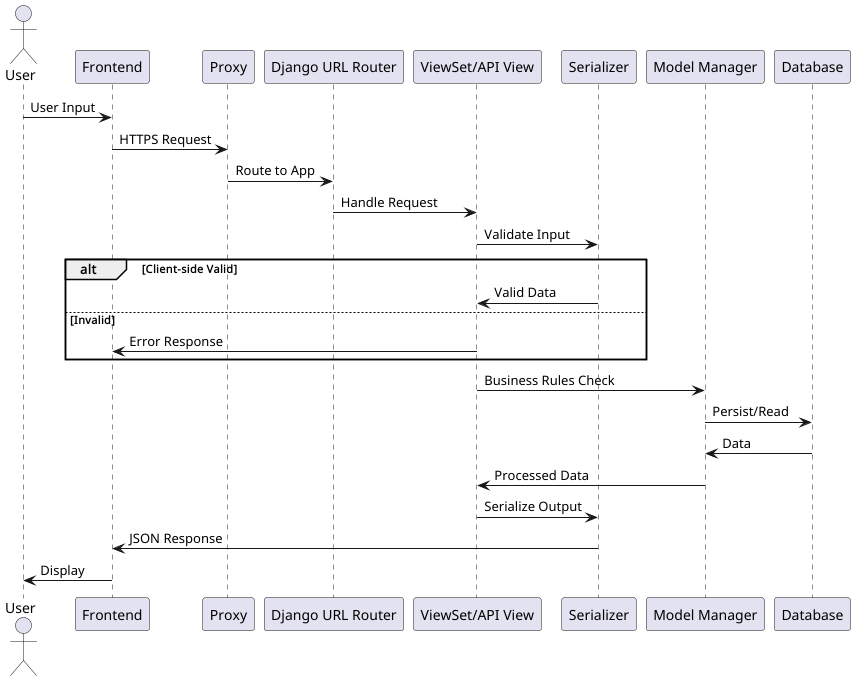

# Hive – Projektdokumentation (Konstruktionsentwurf & Prototyp)
## Inhaltsverzeichnis:

<!-- TOC -->
* [Hive – Projektdokumentation (Konstruktionsentwurf & Prototyp)](#hive--projektdokumentation-konstruktionsentwurf--prototyp)
  * [Inhaltsverzeichnis:](#inhaltsverzeichnis)
  * [Beschreibung des Problems und Kontext](#beschreibung-des-problems-und-kontext)
  * [Zielgruppe/-setzung](#zielgruppe-setzung)
  * [Anforderungen & fachlicher Kontext - Use Cases](#anforderungen--fachlicher-kontext---use-cases)
  * [Funktionale und nicht-funktional Anforderungen](#funktionale-und-nicht-funktional-anforderungen)
  * [Architektur, Konzeption & Design](#architektur-konzeption--design)
  * [Beschreibung der gewählten Architektur & Schnittstellen (REST, Monolith – inkl. Alternativen)](#beschreibung-der-gewählten-architektur--schnittstellen-rest-monolith--inkl-alternativen)
    * [Gewählt: REST-basierter Webservice](#gewählt-rest-basierter-webservice)
    * [Gewählt: modularer Monolith](#gewählt-modularer-monolith)
  * [Technologie-Stack und Komponenten](#technologie-stack-und-komponenten)
    * [Backend: Django + Django REST Framework](#backend-django--django-rest-framework)
    * [Authentifizierung: JWT (tokenbasiert)](#authentifizierung-jwt-tokenbasiert)
    * [API-Dokumentation: OpenAPI/Swagger](#api-dokumentation-openapiswagger)
    * [Datenhaltung: einfache Entwicklung, robustes Zielbild](#datenhaltung-einfache-entwicklung-robustes-zielbild)
    * [Qualitätssicherung: Tests & CI/CD-Idee](#qualitätssicherung-tests--cicd-idee)
  * [Verteilung/Deployment-Ansatz (3-Tier, Docker – inkl. Cloud/On-Prem Einordnung)](#verteilungdeployment-ansatz-3-tier-docker--inkl-cloudon-prem-einordnung)
  * [Implementierung Prototyp](#implementierung-prototyp)
  * [Entwicklungsumgebung, technischer Rahmen und Repository-/Betriebsstruktur](#entwicklungsumgebung-technischer-rahmen-und-repository-betriebsstruktur)
  * [API-Spezifikation (Webservice-Methode, Endpunkt, Beschreibung)](#api-spezifikation-webservice-methode-endpunkt-beschreibung)
  * [Umsetzung der Implementierung (Initialisierung, Prototyping, Dockerisierung,](#umsetzung-der-implementierung-initialisierung-prototyping-dockerisierung)
  * [Validierung & Qualitätssicherung (Testverfahren & -ergebnisse)](#validierung--qualitätssicherung-testverfahren---ergebnisse)
  * [Fazit & Ausblick](#fazit--ausblick)
<!-- TOC -->

---
## Beschreibung des Problems und Kontext
Im Alltag werden für die Organisation kleiner Events häufig Gruppen-Chats genutzt. Das ist
unkompliziert und schnell, führt in der Praxis jedoch immer wieder zu denselben
Problemen: Informationen gehen im Chatverlauf unter, Absprachen werden mehrfach
gestellt und wichtige Entscheidungen sind später nur schwer nachvollziehbar. Dabei
besteht die Planung eines Events organisatorisch nicht nur aus Nachrichten, sondern aus
wiederkehrenden „Objekten“ und „Zuständen“ wie Ort und Zeit, der aktuelle Teilnahme-Status, Beiträge zur Organisation („Wer bringt was mit?“), individuelle Hinweise (z. B.
Allergien oder Einschränkungen) sowie Entscheidungen, die gemeinsam getroffen werden
müssen (z. B. per Abstimmung). Messenger sind für spontane Kommunikation geeignet,
unterstützen aber eine strukturierte, dauerhaft nachvollziehbare Verwaltung solcher
Zustände nur eingeschränkt.

Hive setzt genau an dieser Stelle an und bündelt die Planung eines Events in einer
zentralen, strukturierten Anwendung. Statt unübersichtlicher Chat-Nachrichten bietet Hive
klar definierte Bereiche und Felder: Eventdaten, Einladungen und Teilnahmeverwaltung
sowie typische Planungsdetails wie Begleitpersonen, Allergien/Notizen, eine Bringliste und
flexible Zusatzfelder. Dadurch entsteht eine Lösung, die das bekannte „WhatsApp-Planungschaos“ reduziert. Technisch basiert Hive auf der Idee eines Webservices mit stabilen
Schnittstellen: Wenn Geschäftslogik und Datenhaltung konsistent im Backend umgesetzt
sind, kann ein Web-Client die Informationen zuverlässig anzeigen, bearbeiten und
validieren. Als Webanwendung ist Hive plattformunabhängig im Browser nutzbar, sowohl
am Desktop als auch auf dem Smartphone. So bleibt der aktuelle Stand der Planung
jederzeit nachvollziehbar und unabhängig davon, auf welchem Gerät oder über welchen
Kommunikationskanal die Gruppe gerade interagiert.

---
## Zielgruppe/-setzung
Die primäre Zielgruppe von Hive sind kleinere Freundesgruppen, die regelmäßig gemeinsame Aktivitäten organisieren, etwa Geburtstage,
Spieleabende oder Grillen. In diesem Umfeld ist der Rahmen meist nicht förmlich und die
Gruppengröße überschaubar, trotzdem besteht ein klarer Bedarf an Übersicht. Ort und Zeit
sollen eindeutig sein, Teilnahmen sollen nachvollziehbar bleiben und organisatorische
Details dürfen nicht im Chatverlauf untergehen. Gerade diese Zielgruppe ist besonders
sensibel für Komplexität. Wenn eine Lösung zu viele Schritte, zu viele Menüs oder zu viel
„Overhead“ erzeugt, wird sie im Alltag nicht angenommen. Deshalb ist ein modernes,
minimalistisches Design nicht nur eine ästhetische Entscheidung, sondern ein zentrales
Nutzungsziel.

Ziel von Hive ist es, die Planung kleiner Events zu vereinfachen und alle relevanten
Informationen an einem Ort zu bündeln. Nutzer sollen Freunde zu Events einladen und die
Organisation gemeinsam durchführen können. Im Kern soll die Plattform ermöglichen, dass
die wichtigsten Fragen schnell beantwortbar sind: 
- Wo und wann findet das Event statt? 
- Wer kann teilnehmen? 
- Gibt es Begleitpersonen? 
- Welche Allergien oder Hinweise sind zu
beachten? 
- Wer bringt was mit? 

Zusätzlich soll Hive flexibel genug sein, um sich an
unterschiedliche Eventtypen anzupassen, ohne jedes Mal neue feste Felder einbauen zu
müssen. Dazu dienen frei definierbare Zusatzfelder. Gleichzeitig soll Hive bewusst nicht in
Richtung einer Social-Plattform wachsen. Funktionen werden daher danach bewertet, ob
sie den Kernfluss unterstützen oder unnötig verkomplizieren. Der minimal funktionsfähige
Webservice konzentriert sich entsprechend auf die zentrale Organisation: Events erstellen,
Freunde einladen und Teilnahme bestätigen. Weitere Funktionen sind als Erweiterungen
vorgesehen und können schrittweise ergänzt werden, ohne die Kernfunktionalität zu
destabilisieren.

---
## Anforderungen & fachlicher Kontext - Use Cases


Hive adressiert typische Use Cases aus der Planung kleiner Events, wie im Use-Case-Diagramm oben dargestellt. Der zentrale Ablauf beginnt damit, dass eine organisierende Person (User) ein Event erstellt (UC1) und grundlegende Informationen wie Ort und Zeit festlegt (UC2). Danach werden Freunde eingeladen (UC3), die über die Plattform ihre Teilnahme bestätigen oder absagen (UC4). Dieser Rückmeldeprozess ist fachlich das Herzstück, weil er den wichtigsten Planungszustand abbildet. Gleichzeitig ist er Grundlage für die Zugriffskontrolle, denn viele weitere Funktionen ergeben nur Sinn, wenn klar ist, wer zum Event gehört und wer berechtigt ist, bestimmte Informationen zu sehen oder zu ändern.

Auf dieser Basis bauen weitere fachliche Use Cases auf, die im Diagramm dem Teilnehmer zugeordnet sind. Teilnehmende sollen zusätzliche Informationen hinterlegen können – etwa Begleitpersonen (UC7), Allergien oder persönliche Hinweise (UC9). Dadurch werden wichtige Details nicht im Chat übersehen, sondern strukturiert und leicht auffindbar. Die Koordination der Zutaten reduziert Duplikate und macht offen sichtbar, welche Beiträge offen sind. Damit die Plattform nicht nur für einen Eventtyp funktioniert, können darüber hinaus individuelle Zusatzfelder definiert werden (UC6), die im Diagramm dem User als organisierender Rolle zugewiesen sind. Der fachliche Hintergrund ist, dass verschiedene Events unterschiedliche Anforderungen haben: Bei einem Geburtstag sind andere Informationen relevant als bei einem gemeinsamen Ausflug. Mit Custom Fields lässt sich die Planung flexibel anpassen, ohne dass die Plattform jedes Mal technisch umgebaut werden muss.

Ein weiterer wichtiger Use Case sind Abstimmungen (UC10), die der organisierende User anlegen kann. Sie ermöglichen Gruppenentscheidungen, etwa wenn Termin- oder Standortoptionen gemeinsam ausgewählt werden sollen, und ersetzen typische Chat-Diskussionen, bei denen viele Vorschläge gesammelt werden, aber am Ende unklar bleibt, was die Mehrheit möchte. Optional vorgesehen sind zudem Kommentare (UC11), Dokument-Uploads (UC12), Reaktionen (UC13) und das Teilen von Bildern (UC14), um die Zusammenarbeit weiter zu erleichtern. Diese Use Cases sind im Diagramm bewusst als Optional gekennzeichnet – sie sind nicht Teil des minimal funktionsfähigen Kerns, sondern werden als spätere Ausbaustufe betrachtet, damit der Prototyp im Rahmen des Moduls fokussiert und stabil bleibt.


---
## Funktionale und nicht-funktional Anforderungen
Funktional muss Hive die zentralen Prozesse der Eventplanung als Webservice abbilden.
Dazu gehört zunächst, dass Nutzer sich registrieren und authentifizieren können.
Authentifizierung dient dabei nicht nur dem „Login“, sondern bildet die Grundlage für die
Abgrenzung von Berechtigungen und den Schutz personenbezogener Daten. Auf dieser
Basis sollen Events erstellt, eingesehen und verwaltet werden können. Einladungen
müssen eindeutig einem Event zuordenbar sein und von den eingeladenen Personen
beantwortet werden können. Der Rückmeldeprozess (Zusage/Absage) ist ein
Kernbestandteil, weil er Teilnahme als klaren Zustand modelliert und damit erst eine
strukturierte Planung ermöglicht. Ergänzend sollen Teilnehmende ihre eigenen Daten
pflegen können, zum Beispiel Hinweise oder eine Begleitperson. Damit Hive einen echten
Mehrwert gegenüber einem Chat bietet, müssen außerdem typische
Organisationsaufgaben strukturiert unterstützt werden, etwa Bringlisten, flexible
Zusatzfelder und Abstimmungen. Funktionen wie Kommentare, Reaktionen oder Datei-Uploads sind bewusst nicht Teil des minimalen Funktionsumfangs und werden als spätere
Erweiterung betrachtet, um den Scope kontrollierbar zu halten und die Stabilität des Kerns
nicht zu gefährden.

Nicht-funktional sind vor allem Benutzerfreundlichkeit, Sicherheit und Wartbarkeit die
entscheidenden Architekturtreiber. Benutzerfreundlichkeit bedeutet in diesem
Zusammenhang vor allem: klare, stabile Schnittstellen und konsistente Zustände. Wenn
eine API je Endpunkt unterschiedliche Formate, Fehlerlogiken oder inkonsistente
Statuscodes liefert, steigt die Komplexität im Frontend deutlich und die Fehlerrate nimmt
zu. Deshalb ist Konsistenz ein explizites Qualitätsziel, das sich in einheitlichen Response-Strukturen und einem klaren Fehlerformat widerspiegelt. Sicherheit ist ebenfalls zentral,
weil persönliche Informationen verarbeitet werden und Einladungen potenziell Zugang zu
Eventdaten eröffnen. Daraus leiten sich konkrete Maßnahmen ab: tokenbasierte
Authentifizierung, objektbasierte Zugriffskontrolle (Owner/Teilnehmer) und das Speichern
von Einladungstokens in gehashter Form. Ein konsistentes Fehlerformat ist
zudem sicherheitsrelevant, weil es verhindert, dass interne Details ungewollt preisgegeben
werden, und weil es Angriffsflächen durch uneindeutige Fehlermeldungen reduziert.
Wartbarkeit ist wichtig, weil Hive perspektivisch um weitere Funktionen erweitert werden
soll. Daraus folgt die Entscheidung, Domänen in klar getrennten Modulen zu organisieren
und zentrale Logik nicht vollständig in Controller- oder View-Schichten zu belassen. Eine
geordnete, modulare Codebasis erleichtert es, spätere Features wie Uploads oder
Kommentare hinzuzufügen, ohne bestehende Kernprozesse zu destabilisieren.
Performance ist im aktuellen Umfang nicht als Hochlast-Szenario dimensioniert, soll aber
so angelegt sein, dass typische Lasten kleiner Gruppen stabil laufen und spätere Skalierung
nicht verbaut wird. Tokenbasierte Authentifizierung unterstützt dies, weil Requests
weitgehend stateless verarbeitet werden können. Containerisierte Deployments
unterstützen es ebenfalls, weil sie eine saubere Trennung von Komponenten und im
Bedarfsfall eine horizontale Skalierung der API-Instanzen ermöglichen.

---
## Architektur, Konzeption & Design
Hive ist als Webservice konzipiert und als grundlegende Struktur wurde ein modularer Monolith gewählt. Allgemein ist das Projekt in zwei Teile aufgeteilt: Frontend und Backend. Das Frontend kommuniziert mit dem Backend über eine HTTPS-basierte API (über einen internen Proxy). Dadurch können Domänenobjekte der Eventplanung (z.B. Event, Einladung, Teilnahme und Abstimmung) verwaltet werden. Für diese Architektur haben wir uns aufgrund unserer Usecases und der Rahmenbedingungen eines Semesterprojekts entschieden.
Während der Entwicklung haben wir Frontend und Backend in zwei Github Repos getrennt von einander entwickelt. Anschließend haben wir es in ein gemeinsames Repo zusammengeführt und mit Docker Compose containerisiert. Das System ist also als ein deploybarer Fullstack-Container swarm umgesetzt. Das Backend wird im Code architekturtechnisch in getrennte Bereiche (Django Apps) gegliedert (z. B. Accounts/Authentifizierung, Events, Einladungen, Polls). Wir erreichen damit schnelle Umsetzung, einfache Inbetriebnahme und eine konsistente Datenhaltung, ohne die zusätzliche Komplexität verteilter Systeme zu erzeugen. Gleichzeitig unterstützt die modulare Aufteilung die Wartbarkeit, weil neue Funktionen später in klaren Modulen ergänzt werden können.



Der Request-Flow folgt einem schichtenähnlichen Aufbau, wie er in Django/DRF üblich ist:
Eingehende Requests werden über das zentrale Routing den zuständigen API-Komponenten zugeordnet. Eingaben werden server und clientseitig validiert, fachliche Regeln geprüft und danach persistiert oder ausgelesen. Diese retundant wirkende Umsetzung ist bewusst
gewählt, weil Frontend-Validierung zwar die Bedienbarkeit verbessert, aber technisch
umgangen werden kann. Gerade bei gruppenbasierten Funktionen wie Einladungen,
Teilnahme und Abstimmungen ist das wichtig: Der Webservice muss zuverlässig prüfen, ob
ein Nutzer überhaupt zum Event gehört und ob die übermittelten Daten fachlich gültig sind
(z. B. dass bei einer Abstimmung nur zulässige Optionen verwendet werden). So bleiben
Datenqualität und Zugriffsschutz stabil, unabhängig vom Client.

Auch die Persistenz ist Teil des Architekturentwurfs: Für schnelle Entwicklung ist eine
unkomplizierte Datenhaltung sinnvoll, während für ein produktionsnahes Zielbild eine
robuste Datenbankarchitektur benötigt wird, um Constraints, parallele Zugriffe und Indizes
zuverlässig zu unterstützen. 

Ein weiterer zentraler Baustein ist ein konsistentes Fehler- und Responseverhalten. Die API
nutzt ein einheitliches Fehlerformat, das zentral durchgesetzt wird. Das reduziert
Sonderfälle in der Client-Implementierung, erleichtert das Testen und ist gleichzeitig
sicherheitsrelevant, weil interne Details kontrolliert behandelt werden und nicht
unabsichtlich nach außen gelangen.

---
## Beschreibung der gewählten Architektur & Schnittstellen (REST, Monolith – inkl. Alternativen)
### Gewählt: REST-basierter Webservice
Als Schnittstellenstil wurde REST über HTTPS/JSON gewählt. Das passt sehr gut zu unserem
Anwendungsfall, weil ein Web-Client die Daten direkt konsumieren kann und weil REST im
Web-Kontext etabliert, leichtgewichtig und gut testbar ist. Für ein Semesterprojekt ist
außerdem wichtig, dass Schnittstellen schnell nachvollziehbar und stabil dokumentierbar
sind.
Warum nicht SOAP? SOAP würde im Vergleich einen deutlich höheren Overhead erzeugen
(z. B. XML-Schemas/WSDL-Denke, schwergewichtigere Toolchains) und bringt für unseren
Use Case (kleine Freundesgruppen, typische Web-Client-Nutzung) keinen proportionalen
Mehrwert. Unser Fokus liegt auf klaren Ressourcen, Zuständen und Berechtigungen, nicht
auf komplexen Enterprise-Integrationen.
### Gewählt: modularer Monolith
Wir haben einen Monolithen gewählt, weil er in unserem Kontext die beste Balance aus
Entwicklungsaufwand, Zuverlässigkeit und Nachvollziehbarkeit bietet. Die wichtigsten
Gründe sind:
- Ressourcen & Zeitrahmen: Ein kleines Team kann ein System schneller stabil liefern, wenn Deployment, Logging und Debugging nicht über mehrere Services verteilt werden müssen.
- Konsistenz der Daten: Eventplanung ist stark zustandsorientiert (Einladung, Teilnahme, Beiträge und Abstimmungen). Eine zentrale Datenhaltung vereinfacht Konsistenz und Berechtigungen.
- Sicherheit & Permissions: Querschnittsthemen wie Authentifizierung und Zugriffskontrolle lassen sich zentral und einheitlich umsetzen.

Ein Monolith kann bei stark wachsendem Funktionsumfang unübersichtlicher werden, weil Änderungen und Deployments das gesamte Backend betreffen und eine gezielte Skalierung einzelner Teilbereiche weniger fein möglich ist. In unserem Projekt ist dieser Nachteil jedoch kaum relevant, da der Funktionsumfang klar abgegrenzt ist und die erwartete Nutzung (kleine Freundesgruppen) keine hohe Systemlast erzeugt. Trotz Monolith bleibt Hive evolvierbar: Durch die fachliche Modularisierung im Code können spätere Erweiterungen (z. B. Medien/Uploads oder Benachrichtigungen) als eigenständige Komponenten hinzugefügt werden.

Eine verteilte Architektur wie bei Microservices oder SOA würde zusätzliche
Komplexität einführen, die für unseren Funktionsumfang nicht notwendig ist: Service-Kommunikation, mehrere Deployments, verteilte Fehlerbilder, mehr Monitoring-Aufwand und schwerere Konsistenzfragen. Für die gewählte Zielgruppe und die erwarteten Lastprofile ist diese Komplexität im MVP nicht gerechtfertigt.

---
## Technologie-Stack und Komponenten
### Backend: Django + Django REST Framework
Für das Backend wurde Django mit Django REST Framework gewählt. Ausschlaggebend
waren vor allem Geschwindigkeit und Stabilität im Projektzeitraum: Django liefert mit ORM,
Migrationen, klarer Projektstruktur und bewährtem Ökosystem viele Grundlagen, die man
sonst selbst implementieren müsste. DRF ergänzt dies um etablierte Patterns für Serialisierung,
Validierung und Berechtigungen. Für unseren Use Case ist das besonders passend, weil wir
mehrere zusammenhängende Domänenobjekte mit Beziehungen modellieren und
konsistent absichern müssen.

Flask oder ein sehr minimalistisches Framework wären grundsätzlich möglich, würden aber im Projektzeitraum mehr Eigenbau bedeuten (Struktur, Auth-Integration, konsistente API-Konventionen, Dokumentation/Schema-Erzeugung, Permissions-Patterns). Für unsere Ressourcen wäre das Risiko höher, dass am Ende ein laufendes Projekt geliefert wird, aber Struktur und Qualität leiden.

### Authentifizierung: JWT (tokenbasiert)
Wir nutzen eine tokenbasierte Authentifizierung (JWT), weil sie gut zu einem Web-Client
passt und API-Requests ohne serverseitige Sessionverwaltung ermöglicht. Fachlich ist das
entscheidend, weil Hive private Eventdaten verarbeitet: Der Webservice muss sicher
unterscheiden können, wer welche Daten sehen und ändern darf. Tokenbasierte Auth
macht diese Identitätsprüfung pro Request möglich und unterstützt damit auch spätere
Skalierung (mehrere API-Instanzen sind leichter betreibbar, weil der Server weniger
Session-State halten muss). Zusätzlich wird zeitbasierte Sicherheit gewährleistet, indem JWT-tokens regelmäßig rotiert und veraltete Token geblacklistet werden.

### API-Dokumentation: OpenAPI/Swagger
Für die Schnittstellendokumentation verwenden wir eine OpenAPI-basierte Beschreibung
(inkl. interaktiver Dokumentation). Das ist im Team besonders
hilfreich, weil Endpunkte, Request/Response-Modelle und Validierungsregeln
nachvollziehbar bleiben. Gleichzeitig reduziert es Missverständnisse zwischen Frontend
und Backend, weil die Spezifikation nicht nur „Text“, sondern maschinenlesbar ist.

### Datenhaltung: einfache Entwicklung, robustes Zielbild
Für eine schnelle lokale Entwicklung ist eine gut implementierte Datenhaltung sinnvoll, um
Setup-Zeit zu minimieren. Für ein produktionsnäheres Zielbild ist eine robuste Datenbank
wichtig, um Constraints, Performance und parallele Zugriffe zuverlässig zu unterstützen. Hierfür haben wir Django ORM verwendet, da es sinnvoll implemenitert ist. Modelle müssen nur einmal festgelegt werden und können daraufhin sinnvoll validiert werden. Außerdem ist der OOP aufbau einfach verständlich und eignet sich in Kombination mit Python besonders gut.


### Qualitätssicherung: Tests & CI/CD-Idee
Qualitätssicherung erfolgt über Tests und systematische Checks. Ziel ist, Kernflüsse wie Authentifizierung, Eventverwaltung und Einladungs-/Teilnahmeprozesse sowie wichtige Berechtigungsregeln reproduzierbar zu prüfen. Als CI/CD-Idee bietet sich eine GitHub-Pipeline an, die Tests automatisch ausführt und Container-Images baut. Der Hauptnutzen liegt hier in der Fehlerfrüherkennung. Fehler sollen durch fehlschlagende Tests gefunden werden, bevor sie in Main gemerged werden.

---
## Verteilung/Deployment-Ansatz (3-Tier, Docker – inkl. Cloud/On-Prem Einordnung)
Hive lässt sich als 3-Tier-Webanwendung beschreiben: Ein Web-Client stellt die Oberfläche
bereit, ein API-Backend kapselt Geschäftslogik und Zugriffskontrolle, und eine Datenbank
persistiert den Zustand. Diese Trennung ist für unser Projekt sinnvoll, weil sie
Verantwortlichkeiten klar hält und eine realistische Betriebsform widerspiegelt. Selbst bei
kleiner Nutzerzahl ist es vorteilhaft, wenn UI und Datenhaltung nicht „vermengt“ werden, da
sich Änderungen und Betrieb dadurch einfacher gestalten lassen.
Für die Abgabe und den Betrieb wird Docker genutzt, weil es eine reproduzierbare
Umgebung schafft. Eine lauffähige Instanz soll unabhängig vom Endgerät startbar sein (Live-Demo, Abgabe, Bewertung). Docker
unterstützt außerdem saubere Konfigurationsprinzipien über Umgebungsvariablen und
erleichtert es, bei Bedarf weitere Komponenten einzubinden (z. B. Datenbankcontainer; in
einem weiter ausgebauten Setup auch ergänzende Infrastruktur wie Caching, Background
Jobs oder Storage).

Cloud-Betrieb wäre grundsätzlich möglich, da ein containerisierter Webservice gut in
typische Cloud-Modelle passt. Für unser Projekt ist jedoch ein cloud-neutraler Ansatz
sinnvoller: Er vermeidet Providerabhängigkeiten und hält den Fokus auf Architektur,
Schnittstellen und Implementierungsqualität statt auf cloud-spezifische Konfiguration.
Gleichzeitig schließt die gewählte Struktur eine spätere Migration nicht aus, da
standardisierte Komponenten (HTTP-API, Container, Datenbank) typische Voraussetzungen
für Cloud-Deployments sind.

---
## Implementierung Prototyp
Der Prototyp setzt den minimalen Funktionsumfang der Plattform um und bildet die zentralen Domänen der Eventplanung ab. Im Fokus stehen das Erstellen und Verwalten von Events, das Einladen von Personen sowie die Rückmeldung zur Teilnahme. Ergänzend werden typische Planungsfunktionen unterstützt, die in kleinen Gruppen häufig benötigt werden, etwa eine Bringliste, flexibel definierbare Zusatzfelder und Abstimmungen. Die Implementierung ist konsequent nach der im Entwurf beschriebene Architektur umgesetzt. Somit zeigt sich, dass diese nicht nur theoretisch formuliert sind, sondern auch in der Praxis konkret anwenden lassen. Sicherheitsrelevante Aspekte werden im Prototyp konsistent berücksichtigt und bewusst serverseitig umgesetzt. Zugriffe auf Ressourcen werden objektbasiert geprüft, sodass bestimmte Aktionen ausschließlich der organisierenden Person vorbehalten sind, während Teilnehmende nur ihre eigenen Daten bearbeiten und im vorgesehenen Rahmen interagieren können. Einladungs-Tokens werden nicht im Klartext persistiert, wodurch ein typisches Risiko in Einladungsprozessen reduziert wird. Zusätzlich wird ein einheitliches Fehlerformat zentral durchgesetzt, was sowohl die Fehlersuche im Backend als auch die Fehlerbehandlung im Client vereinfacht. Insgesamt zeigt der Prototyp damit, wie nicht-funktionale Anforderungen wie Sicherheit und Wartbarkeit in konkrete technische Maßnahmen und eine saubere Implementierungsstruktur übersetzt wurden.

---
## Entwicklungsumgebung, technischer Rahmen und Repository-/Betriebsstruktur

### Entwicklungsumgebung & technischer Rahmen

Die Entwicklungsumgebung ist auf eine schnelle und reproduzierbare Inbetriebnahme
ausgelegt. Lokale Konfigurationen und sensible Werte werden über Umgebungsvariablen
gesteuert. Für die Entwicklung können diese in einer lokalen Environment-Datei hinterlegt
werden. Dieses Vorgehen ist organisatorisch sinnvoll, weil Teammitglieder unabhängig
voneinander arbeiten können. Gleichzeitig wird damit der Übergang in eine
produktionsnahe Umgebung erleichtert, da containerisierte Deployments und CI/CD-Pipelines ebenfalls typischerweise auf environmentbasierte Konfigurationen setzen.
Kommuniziert wird über HTTP mit JSON als Payload, da dies dem Standard für REST-APIs
entspricht und von Web-Clients direkt unterstützt wird. Die Laufzeitumgebung basiert auf
Python; als Framework kommen Django und Django REST Framework zum Einsatz. Die
Auswahl zielt auf ein stabiles, gut dokumentiertes Ökosystem, das im Projektkontext eine
klare Struktur, bewährte Best Practices und eine nachvollziehbare Implementierung
ermöglicht.

### Repository-Struktur

Das Projekt ist als Monorepo organisiert, das alle drei Hauptkomponenten – Backend,
Frontend und Proxy – gemeinsam versioniert und über eine einzelne `docker-compose.yml`
orchestriert. Diese Entscheidung erleichtert die gemeinsame Inbetriebnahme, weil alle
Teile des Systems aus einem einzigen Verzeichnis heraus gestartet werden können, ohne
dass Abhängigkeiten zwischen separaten Repositories koordiniert werden müssen. Innerhalb
des Monorepos ist jede Komponente klar abgegrenzt: Das Backend gliedert sich nach
fachlichen Domänen (Django Apps), das Frontend nach technischen Schichten (api, context,
pages, components), und der Proxy kapselt die Netzwerkkonfiguration vollständig.
Die folgende Übersicht zeigt den vollständigen Aufbau des Repositories mit allen relevanten
Dateien und Verzeichnissen:

```
HiveCombined/                          ← Monorepo-Wurzel
├── .env                               ← Lokale Umgebungsvariablen (nicht versioniert)
├── .env.example                       ← Vorlage für Umgebungsvariablen
├── docker-compose.yml                 ← Orchestrierung aller Container (3-Tier)
│
├── Backend/                           ← Django-Backend (API-Tier)
│   ├── Dockerfile                     ← Container-Image des Backends
│   ├── entrypoint.sh                  ← Startskript (Migrationen, Server)
│   ├── manage.py                      ← Django-Management-CLI
│   ├── requirements.txt               ← Python-Abhängigkeiten
│   ├── pytest.ini                     ← Testkonfiguration
│   ├── schema.yaml                    ← OpenAPI-Spezifikation (generiert)
│   │
│   ├── hive/                          ← Django-Projektkern / Querschnitt
│   │   ├── settings/
│   │   │   ├── base.py                ← Gemeinsame Einstellungen
│   │   │   ├── dev.py                 ← Entwicklungsumgebung
│   │   │   └── prod.py                ← Produktionsumgebung
│   │   ├── api/
│   │   │   └── exceptions.py          ← Zentrales, einheitliches Fehlerformat
│   │   ├── urls.py                    ← Zentrales URL-Routing
│   │   ├── asgi.py / wsgi.py          ← Server-Einstiegspunkte
│   │   └── __init__.py
│   │
│   ├── accounts/                      ← Domäne: Authentifizierung & Nutzer
│   │   ├── models.py                  ← Nutzermodell
│   │   ├── serializers.py             ← Ein-/Ausgabe-Validierung
│   │   ├── views.py                   ← API-Endpunkte (Registrierung, Token)
│   │   ├── urls.py
│   │   ├── tests.py
│   │   └── migrations/
│   │
│   ├── events/                        ← Domäne: Events & Planung
│   │   ├── models.py                  ← Event, CustomField, BringList, …
│   │   ├── serializers.py
│   │   ├── views.py                   ← CRUD-Endpunkte für Events
│   │   ├── permissions.py             ← Objektbasierte Zugriffskontrolle
│   │   ├── services.py                ← Fachliche Geschäftslogik
│   │   ├── urls.py
│   │   ├── tests.py
│   │   └── migrations/
│   │
│   ├── invitations/                   ← Domäne: Einladungen & RSVP
│   │   ├── models.py                  ← Invitation (Token gehasht), Participation
│   │   ├── serializers.py
│   │   ├── views.py
│   │   ├── services.py
│   │   ├── urls.py
│   │   ├── tests.py
│   │   └── migrations/
│   │
│   ├── polls/                         ← Domäne: Abstimmungen
│   │   ├── models.py                  ← Poll, PollOption, Vote
│   │   ├── serializers.py
│   │   ├── views.py
│   │   ├── services.py
│   │   ├── urls.py
│   │   ├── tests.py
│   │   └── migrations/
│   │
│   ├── tests/
│   │   └── test_hive_api.py           ← Integrationstest (End-to-End-Flows)
│   └── media/                         ← Hochgeladene Mediendateien (Laufzeit)
│
├── Frontend/                          ← React-Frontend (Client-Tier)
│   ├── Dockerfile
│   ├── entrypoint.sh
│   ├── vite.config.ts                 ← Build-Werkzeug (Vite)
│   ├── package.json
│   ├── tailwind.config.js             ← CSS-Framework
│   └── src/
│       ├── main.tsx / App.tsx         ← Einstiegspunkt & Routing
│       ├── constants.ts               ← Zentrale Konfigurationswerte
│       ├── api/                       ← API-Client-Schicht
│       │   ├── client.ts              ← Axios-Instanz + JWT-Handling
│       │   ├── auth.ts
│       │   ├── events.ts
│       │   ├── invitations.ts
│       │   ├── participation.ts
│       │   ├── polls.ts
│       │   ├── contributions.ts
│       │   └── customFields.ts
│       ├── context/
│       │   ├── AuthContext.tsx        ← Globaler Authentifizierungszustand
│       │   └── PrivateRoute.tsx       ← Zugriffsschutz für Routen
│       ├── pages/                     ← Seitenkomponenten (je Route eine Datei)
│       │   ├── LoginPage.tsx
│       │   ├── RegisterPage.tsx
│       │   ├── EventListPage.tsx
│       │   ├── EventDetailPage.tsx
│       │   ├── CreateEventPage.tsx
│       │   ├── EditEventPage.tsx
│       │   └── InviteRespondPage.tsx
│       ├── components/                ← Wiederverwendbare UI-Komponenten
│       │   ├── Navbar.tsx
│       │   ├── ParticipantList.tsx
│       │   ├── InviteForm.tsx
│       │   ├── PollList.tsx / PollResults.tsx
│       │   ├── ContributionList.tsx
│       │   ├── CustomFieldList.tsx
│       │   ├── MyParticipation.tsx
│       │   ├── Pagination.tsx
│       │   └── ErrorBoundary.tsx
│       ├── types/
│       │   └── index.ts               ← Gemeinsame TypeScript-Typdefinitionen
│       └── assets/                    ← Statische Ressourcen (Bilder, Icons)
│
├── proxy/                             ← Nginx-Reverse-Proxy (Netzwerk-Tier)
│   ├── Dockerfile
│   ├── nginx.conf                     ← Basiseinstellungen
│   ├── default.conf.template          ← Virtuelle Hosts (TLS, Routing)
│   └── entrypoint.sh
│
├── certs/
│   └── generate.sh                    ← Skript zur Erzeugung von TLS-Zertifikaten
│
└── docs/                              ← Projektdokumentation & Diagramme
    ├── Dokumentation.md
    ├── HiveUsecases.png
    ├── RequestFlow.png / .puml
    └── usecases.puml
```

Die Struktur macht deutlich, dass fachliche Bereiche konsequent getrennt sind: Jede
Django-App (`accounts`, `events`, `invitations`, `polls`) trägt ihre eigenen Modelle,
Serializer, Views, Services und Migrationen. Querschnittsthemen wie zentrales Routing,
einheitliches Fehlerformat und umgebungsabhängige Einstellungen sind im `hive/`-Kernpaket
gebündelt, sodass sie nicht in einzelnen Domänen redundant implementiert werden müssen.
Im Frontend spiegelt die Aufteilung in `api/`, `context/`, `pages/` und `components/` eine
klare Schichttrennung wider: API-Kommunikation, globaler Zustand, seitenspezifische
Logik und wiederverwendbare UI-Elemente bleiben voneinander entkoppelt. Diese Struktur
erleichtert Wartung und Erweiterung, weil Änderungen an einer Schicht die anderen nicht
zwingend berühren.


---
## API-Spezifikation (Webservice-Methode, Endpunkt, Beschreibung)
Die API ist ressourcenorientiert aufgebaut und stellt die zentralen Objekte der Domäne über
standardisierte HTTP-Semantik bereit. Funktional gliedert sich die Schnittstelle in mehrere
Bereiche: einen Authentifizierungsbereich für Registrierung und Tokenverwaltung, einen
Eventbereich für das Erstellen, Anzeigen und Bearbeiten von Events sowie ergänzende
Teilbereiche für Einladungen und Teilnahme. Zusätzlich werden planungsrelevante Inhalte
unterstützt, die in kleinen Gruppen häufig vorkommen, etwa die Verwaltung eigener
Teilnahmeinformationen, eine Bringliste, flexibel definierbare Zusatzfelder sowie
Abstimmungen. Das Schnittstellendesign ist darauf ausgerichtet, dass ein Web-Client die
für typische Nutzeransichten benötigten Daten zuverlässig und konsistent abrufen und
ändern kann, ohne auf intransparente Zustände oder schwer nachvollziehbare
Abhängigkeiten angewiesen zu sein.
Ein zentrales Prinzip der Spezifikation ist Einheitlichkeit. Statuscodes werden konsistent
verwendet, und Fehler folgen einem gemeinsamen Schema, das durch eine zentrale
Fehlerbehandlung durchgesetzt wird. Dadurch lassen sich Fehlerfälle im Client
systematisch behandeln, ohne dass pro Funktion Sonderlogik entstehen muss. Für die
Zielgruppe ist das indirekt relevant, weil eine einfache Oberfläche nur dann stabil
funktioniert, wenn das Backend Fehlersituationen klar und vorhersehbar kommuniziert und
der Client nicht in uneindeutigen Zwischenzuständen endet. Ergänzend wird die API formal
dokumentiert: Über ein OpenAPI-Schema liegt eine maschinenlesbare Spezifikation vor, die
die Schnittstelle nachvollziehbar macht und als Grundlage für automatisierte Prüfungen (z.
B. Konsistenz- oder Contract-Tests) dienen kann.
Berechtigungen sind als fester Bestandteil der Schnittstelle definiert, da Hive
personenbezogene und eventbezogene Daten verwaltet. Bestimmte Aktionen sind auf die
organisierende Person beschränkt, während Teilnehmende innerhalb eines Events nur in
dem Umfang handeln können, der fachlich vorgesehen ist. Besonders relevant ist dies im
Einladungsprozess: Einladungen sind praktisch, dürfen aber nicht dazu führen, dass
beliebige Dritte Zugriff auf Eventdaten erhalten. Daher ist bei der Beantwortung einer
Einladung sicherzustellen, dass der eingeloggte Nutzer zur Einladung passt. Dieses
Zusammenspiel zeigt, dass die API-Spezifikation nicht nur beschreibt, welche Funktionen
existieren, sondern auch, unter welchen Voraussetzungen und Rollen diese Funktionen
ausgeführt werden dürfen.

---
## Umsetzung der Implementierung (Initialisierung, Prototyping, Dockerisierung,
Integration, Validierung)
Die Implementierung wurde schrittweise und nachvollziehbar aufgebaut. Zu Beginn stand
die Initialisierung des Projekts: Es wurde das Grundgerüst des Backends erstellt, die
fachlichen Module angelegt und die Basiskonfiguration so eingerichtet, dass eine klare
Trennung von Verantwortlichkeiten entsteht. Dieser Schritt ist für die spätere Wartbarkeit
entscheidend, weil sich strukturelle Entscheidungen aus der Anfangsphase direkt darauf
auswirken, wie einfach sich neue Funktionen ergänzen lassen und wie stark fachliche
Bereiche im Code voneinander abhängig sind.
Darauf aufbauend wurden die Domänenmodelle entworfen und die Persistenz über
Migrationen vorbereitet. Bei Hive ist ein sauberer Domänenentwurf besonders wichtig, weil
zentrale Funktionen stark über Beziehungen verbunden sind: Einladungen beziehen sich
auf Events und Nutzer, Teilnahmeobjekte bilden den RSVP-Status ab, und Abstimmungen
stehen wiederum in Beziehung zu Events und Teilnehmenden. Wenn diese
Zusammenhänge konsistent modelliert sind, lassen sich fachliche Regeln und
Berechtigungen zuverlässig umsetzen, etwa die Prüfung, ob ein Nutzer zu einem Event
gehört und damit bestimmte Aktionen ausführen darf.
Im nächsten Schritt wurden die API-Komponenten implementiert. Dabei wurden
Validierungen und Berechtigungen serverseitig integriert, damit fachliche Regeln nicht nur
in der Oberfläche „vorausgesetzt“, sondern im Webservice verbindlich durchgesetzt
werden. Für die Architekturargumentation ist dieser Punkt zentral: Die API dient nicht nur
als Zugriffsschicht auf Daten, sondern stellt die fachliche Integrität des Systems sicher.
Ergänzend wurde eine formale API-Dokumentation über OpenAPI integriert, damit die
Schnittstelle kontinuierlich nachvollziehbar bleibt und sowohl für Entwicklung als auch
Tests genutzt werden kann.
Die Dockerisierung ist als Abgabeziel vorgesehen, um die Anwendung in einer
reproduzierbaren Umgebung lauffähig bereitzustellen. Dadurch wird sichergestellt, dass
das System nicht nur auf einzelnen Entwicklerrechnern funktioniert, sondern als definierte
Instanz startbar ist. Abhängig vom Ausbaustand umfasst das Setup neben dem API-Dienst
auch eine Datenbank sowie optional weitere unterstützende Komponenten. Abschließend
wird der Prototyp durch automatisierte Tests, Framework-Checks und eine manuelle End￾to-End-Validierung abgesichert, sodass die Kernflüsse stabil nachweisbar und in der Live-Demo zuverlässig demonstrierbar sind.

---
## Validierung & Qualitätssicherung (Testverfahren & -ergebnisse)
Die Qualitätssicherung in Hive stützt sich auf automatisierte Tests und systematische
Prüfmechanismen. Automatisierte Tests zielen insbesondere auf die zentralen End-to-End￾Flüsse ab, die für die Nutzbarkeit des Systems entscheidend sind: von der Authentifizierung
über das Erstellen eines Events und das Einladen von Personen bis hin zur
Teilnahmebestätigung und weiteren Interaktionen, beispielsweise Abstimmungen.
Ergänzend werden Framework-Checks eingesetzt, um Konfiguration und grundlegende
Deploy-Fähigkeit zu prüfen. Diese Kombination ist im Webservice-Kontext besonders
wichtig, da Fehler häufig nicht ausschließlich aus der fachlichen Logik entstehen, sondern
durch Konfiguration verursacht werden können, etwa durch CORS-Einstellungen,
Sicherheitsheader oder Token-Konfigurationen. Durch frühe und wiederholbare Prüfungen
sinkt das Risiko, dass solche Probleme erst bei der Live-Demo oder in der Abgabe sichtbar
werden.
Ein weiterer zentraler Qualitätsfaktor ist die Konsistenz der API. Durch serverseitige
Validierung, einheitliche Response-Strukturen und ein standardisiertes Fehlerformat
entstehen weniger Sonderfälle im Client, was die Stabilität der gesamten Anwendung
erhöht. Zusätzlich trägt eine maschinenlesbare API-Dokumentation (OpenAPI) zur
Qualitätssicherung bei, da sie als gemeinsame Referenz für Implementierung und Tests
dient und perspektivisch auch automatisierte Schnittstellenprüfungen (z. B. Contract-Tests)
ermöglicht.
Konkrete Testergebnisse und Kennzahlen hängen vom aktuellen Ausbaustand der Test￾Suite ab und können für die finale Abgabe präzisiert werden, beispielsweise durch die
Angabe, welche Kernflüsse automatisiert abgedeckt sind und wie die Tests in eine CI/CD￾Pipeline eingebunden werden. Unabhängig davon ist das Vorgehen so angelegt, dass
Testläufe und Checks reproduzierbar durchgeführt und damit als belastbarer Nachweis für
die Funktionsfähigkeit und Stabilität des Webservices dokumentiert werden können.

---
## Fazit & Ausblick
Hive zeigt, dass sich die Organisation kleiner Events als klar strukturierter Webservice
umsetzen lässt, der die typischen Schwächen einer Planung über Messenger-Gruppen
reduziert. Durch die zentrale Abbildung von Zuständen entsteht eine verlässliche Grundlage
für Übersicht und Zusammenarbeit in kleinen Gruppen. Die gewählten Architektur- und
Technologieentscheidungen – REST als Schnittstellenstil, ein modularer Monolith als
Backend-Architektur und Django/DRF als Umsetzungstechnologie – sind im Rahmen eines
Semesterprojekts besonders passend, weil sie eine schnelle prototypische Umsetzung mit
konsistenter Datenhaltung, guter Dokumentierbarkeit und einem klaren Sicherheits- und
Berechtigungskonzept verbinden. Entscheidend ist dabei, dass diese Entscheidungen
direkt aus den Anforderungen abgeleitet wurden: Die Zielgruppe benötigt eine einfache,
schlanke Lösung, der Projektumfang erfordert eine zügige Iteration, und die Verarbeitung
privater Eventdaten macht eine robuste Zugriffskontrolle notwendig. Vor diesem
Hintergrund ist der gewählte Ansatz gegenüber verteilten Architekturen oder
schwergewichtigeren Schnittstellenstilen die pragmatischere und risikoärmere Wahl.
Als Ausblick bieten sich Funktionen an, die bewusst nicht Teil des minimalen
Funktionsumfangs sind, aber den Nutzen der Plattform weiter erhöhen können. Dazu
zählen insbesondere Kommentare, Reaktionen sowie der Upload und das Teilen von
Dokumenten oder Bildern im Kontext eines Events. Diese Erweiterungen lassen sich bei
sauberer Beibehaltung der Domänenstruktur als zusätzliche Module ergänzen, ohne den
Kernfluss (Event → Einladung → Teilnahme) zu gefährden. Ebenso kann das Deployment
schrittweise produktionsnäher ausgebaut werden, etwa durch eine vollständige Docker￾Compose-Umgebung mit separater Datenbank, ergänzenden Diensten für
Hintergrundverarbeitung oder einem externen Objekt-Storage. Sollte Hive in einem
späteren Szenario deutlich wachsen, wären weitergehende Architekturentwicklungen
denkbar, beispielsweise die Auslagerung einzelner, stark belasteter oder fachlich klar
abgrenzbarer Bereiche. Für die Zielgruppe kleiner Freundesgruppen und den Umfang dieser
Prüfungsleistung ist der aktuelle Ansatz jedoch die sinnvollste Grundlage, weil er die
Anforderungen direkt erfüllt und gleichzeitig Erweiterbarkeit ermöglicht.
